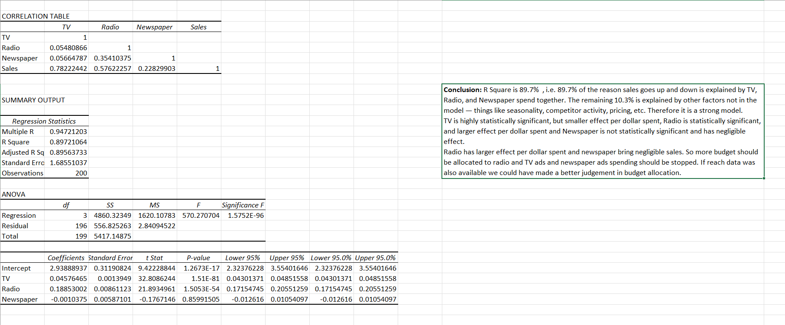

## Advertisement- Correlation and Regression Analysis

### Business Question
On which channel should the company spend more of its advertising budget for more sales?

### Dataset
Source: Kaggle
Size: 6 kB
Columns: Index, TV, Radio, Newspaper, Sales

### Method
First calculated correlation between channels and between channels and sales. After checking for multicollinearity used Excel’s Data Analysis Toolpak to generate the regression outputs.

### Key Findings
- Correlation—Independent vs Dependant Variables: TV vs Sales: 0.782 | Radio vs Sales: 0.576 | Newspaper vs Sales: 0.228
- Correlation- Between Independent Variables: TV vs Radio: 0.054 | TV vs Newspaper: 0.056 | Radio vs Newspaper: 0.354
- p- value- TV: 1.51E-81 | Radio: 1.51E-54 | Newspaper: 0.859
- Coefficients- TV: 0.045 | Radio: 0.188 | Newspaper: -0.001
- No two independent variables are highly correlated so we can determine the individual effect of each independent variable on dependent variable
- TV is highly statistically significant, but smaller effect per dollar spent, Radio is statistically significant, and larger effect per dollar spent and Newspaper is not statistically significant and has negligible effect.
- 89.7% of the reason sales goes up and down is explained by TV, Radio, and Newspaper spend together. The remaining 10.3% is explained by other factors not in the model — things like seasonality, competitor activity, pricing, etc. Therefore it is a strong model.

### Recommendation
- TV is highly statistically significant, but smaller effect per dollar spent, Radio is statistically significant, and larger effect per dollar spent and Newspaper is not statistically significant and has negligible effect.
- Radio has larger effect per dollar spent and newspaper bring negligible sales. So more budget should be allocated to radio and TV ads and newspaper ads spending should be stopped. If reach data was also available we could have made a better judgement in budget allocation. 

### Tools Used
Microsoft Excel — Formula-Based Analysis, Data Analysis Toolpak
